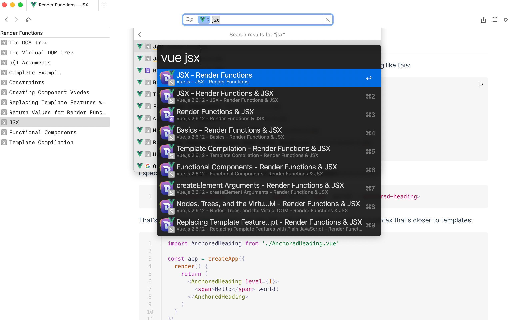
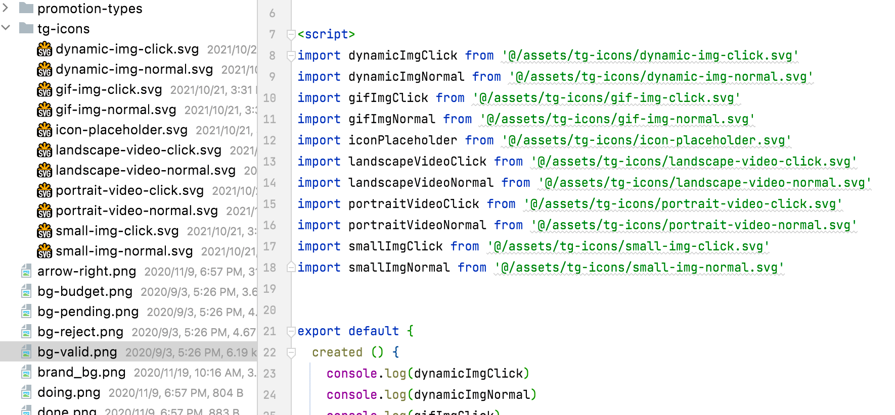
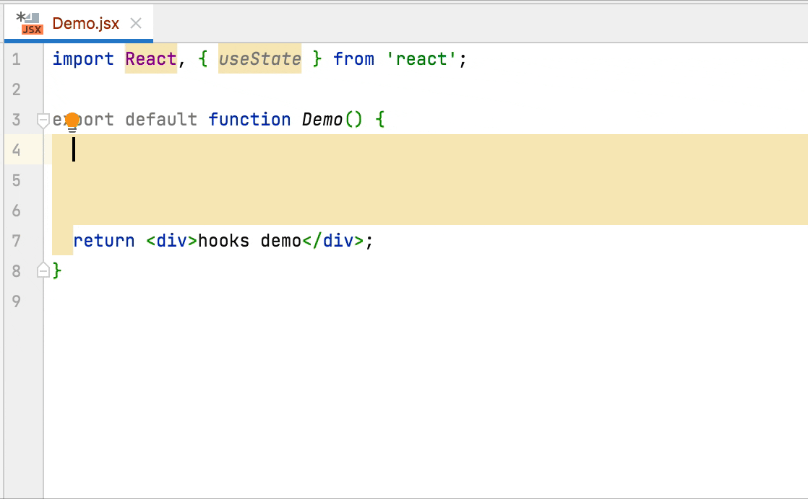
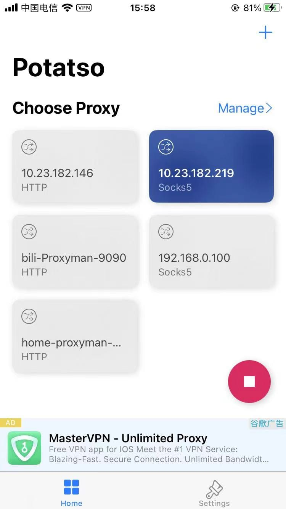
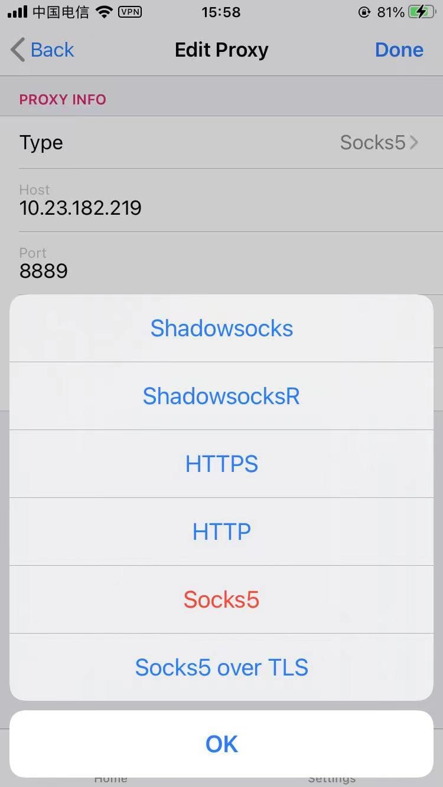
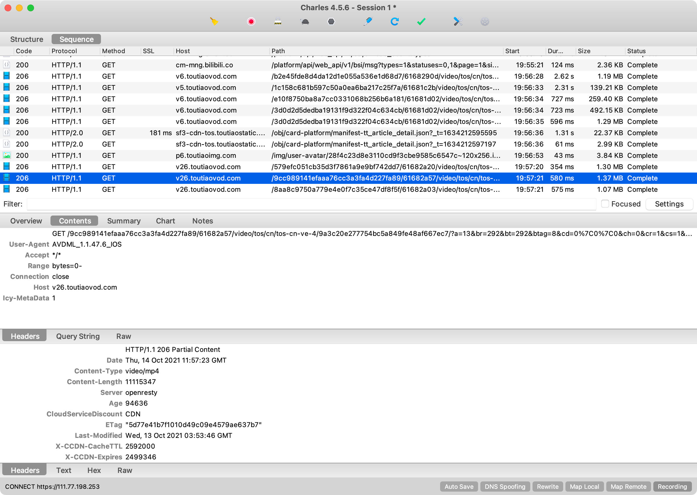
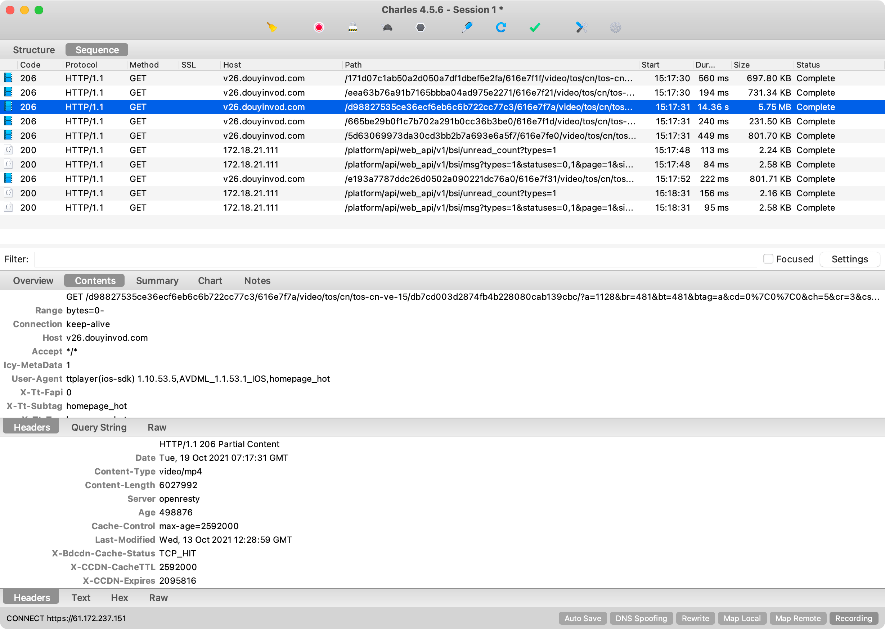
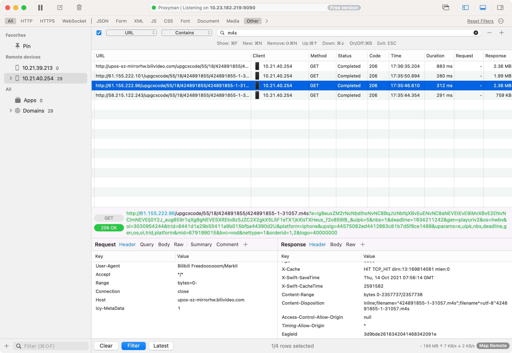
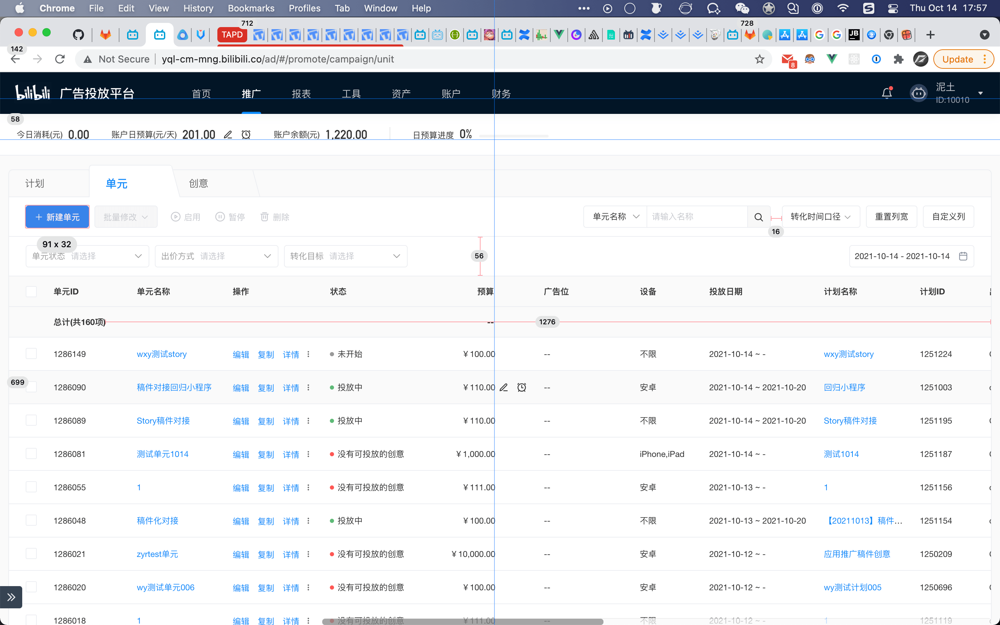

---
# try also 'default' to start simple
theme: seriph
download: false
# random image from a curated Unsplash collection by Anthony
# like them? see https://unsplash.com/collections/94734566/slidev
background: https://source.unsplash.com/collection/94734566/1920x1080
# apply any windi css classes to the current slide
class: 'text-center'
# https://sli.dev/custom/highlighters.html
highlighter: shiki
# some information about the slides, markdown enabled
info: |
  ## Slidev Starter Template
  Presentation slides for developers.

  Learn more at [Sli.dev](https://sli.dev)
---

# Develop Productivity

### 开发生产力闲扯

---
class: 'gradient-h1'
---

# 主要内容

- 🎩 **Alfred App**

- 📑 **Dash App**

- ⛈ **WebStorm/VSCode**

- 🚵‍♂️ **Charles**

- 🍴 **PixelSnap2** 

- 🥳 **Bonus Apps**

---
class: 'gradient-h1'
---

# Alfred App 

[https://www.alfredapp.com](https://www.alfredapp.com/)

- 一些常规操作
- Powerpack
  - 剪贴板历史, Snippets
  - Workflow
    - 系统主题等快速切换, `dark/light mode`, `night shift`, `免打扰模式`等
    - 快速搜索 npm 库, `npm`
    - 快速切到指定 浏览器tab, `tb`
    - 快速打开指定网页, app(用app名不同的关键词)
    - 快速查看时间格式, `time 1634195208492` -> `2021-10-14 15:06:48`
    - 快速生成二维码，`qr url`
    - 自己用JS开发个workflow, [sindresorhus/alfy](https://github.com/sindresorhus/alfy)

---
class: 'gradient-h1'
---

# Dash App

快速查看各种文档的app, 配合Alfred快速搜索, [https://kapeli.com/dash](https://kapeli.com/dash)



---
class: 'gradient-h1'
---

# WebStorm/VSCode

- File structure(`CMD + F12`), 比 `CMD + F`更快的查看文件变量，方法，html tab等
- Multiple cursors, Column Selection Mode，多光标输入、多列选择模式
- Local History, 本地历史
- Scratch file (`CMD + SHIFT + N`)，创建临时文件
- Quokkajs plugin, 快速编写代码，实时看效果
- 其他一些好用的快捷键
  - 当前文件快速定位到文件目录里的对应位置(包括node_modules里的文件)(`CTRL + CMD + <-`)
  - Search Everywhere, `SHIFT + SHIFT`, 搜索配置/操作(`CMD + SHIFT + P/A`), etc...
  - Surround Width(`CMD + ALT + T`), 快速2遍加tag, 方法调用等
  - postfix, `var1.logname` -> `console.log('var1: ', var1)`
  - live template, e.g: 
    - `tc` -> try/catch block; 
    - `ushook` -> `const [dataList, setDataList] = useState([]);`

---
class: 'gradient-h1'
---

# Multiple Cursors多光标 demo

  

---
class: 'gradient-h1'
---

# WebStorm "ushook" live template demo

  

---
class: 'gradient-h1'
---

# Charles

- 可替换浏览器Switchy Omega插件
  - 通过Charles的 Map Remote 工具
    - 真香的地方：
      - 配置一次到处用，多浏览器，局域网其他机器，虚拟机里windows都可以直接用
      - app里H5测孵化api更方便
    - 不香的地方：
      - 没有分组功能，配了一长串，有时不好找
  - Rewrite, Map Local, DNS Spoofing, Auto Save
- https/socks proxy, .pac file自动代理, https://chls.pro/10.23.182.219.pac
- 手机app 抓包, 抓取 Wifi Http 代理抓不到的数据，e.g: 视频数据，有些app的支付请求数据
  - 配合手机app: `Potatso Lite`, `Brook`


---
class: 'gradient-h1'
---

# Charles 抓取手机视频数据


<div grid="~ cols-2 gap-2" m="-t-2">

  ```yaml
  ---
  手机配置Potatso Lite， 开启VPN，  
  ---
  ```

  ```yaml
  ---
  设置外部转发代理(这里既是Mac上Charles的Http/Socks代理地址)
  ---
  ```

  

  

</div>

---
class: 'gradient-h1'
---

# Charles 头条视频抓包

  

---
class: 'gradient-h1'
---

# Charles 抖音视频抓包

  

---
class: 'gradient-h1'
---

# Charles 替代品

[Proxyman](https://proxyman.io/), Mac原生app, 下面抓取视频Proxyman的截图

  


---
class: 'gradient-h1'
---

# PixelSnap2

UI debug, 验收利器， [https://getpixelsnap.com/](https://getpixelsnap.com/)  
跟 `Figma`, `Sketch`, `Affinity Suite`, `Adobe XD` 设计软件很好的集成

  


---
class: 'gradient-h1'
---

# Bonus Apps

- Bartendar
- Hazeover
- https://github.com/jaywcjlove/awesome-mac

---
layout: center
class: text-center
---

# <Party v-if="$slidev.nav.currentPage === $slidev.nav.total" :nav="$slidev.nav">🎉 Thank You 🥳</Party>

