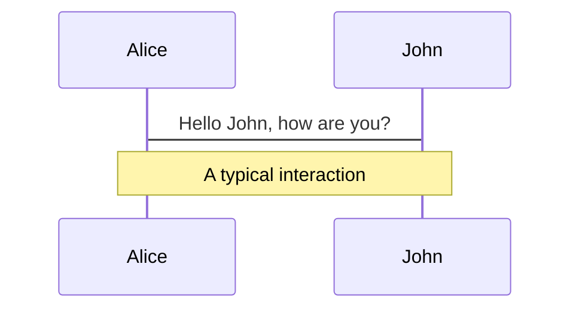
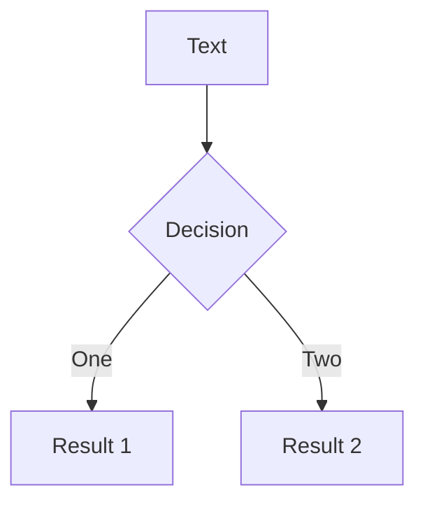

---
# try also 'default' to start simple
theme: seriph
# random image from a curated Unsplash collection by Anthony
# like them? see https://unsplash.com/collections/94734566/slidev
background: https://source.unsplash.com/collection/94734566/1920x1080
# apply any windi css classes to the current slide
class: 'text-center'
# https://sli.dev/custom/highlighters.html
highlighter: shiki
# some information about the slides, markdown enabled
info: |
  ## Slidev Starter Template
  Presentation slides for developers.

  Learn more at [Sli.dev](https://sli.dev)
---

# &lt;video/&gt; 标签

## 从入门到入坑(maybe 放弃)

<!-- <div class="pt-12">
  <span @click="$slidev.nav.next" class="px-2 p-1 rounded cursor-pointer" hover="bg-white bg-opacity-10">
    Press Space for next page <carbon:arrow-right class="inline"/>
  </span>
</div> -->

<a href="https://github.com/slidevjs/slidev" target="_blank" alt="GitHub"
  class="abs-br m-6 text-xl icon-btn opacity-50 !border-none !hover:text-white">
  <carbon-logo-github />
</a>

<!--
The last comment block of each slide will be treated as slide notes. It will be visible and editable in Presenter Mode along with the slide. [Read more in the docs](https://sli.dev/guide/syntax.html#notes)
-->

---

# 主要内容

<!-- Slidev is a slides maker and presenter designed for developers, consist of the following features -->

- 📝 **video标签基本用法** - 直接MP4链接

- 🎨 **主流视频网站video标签地址** - Blob URL

- 🧑‍💻 **MSE API** - MediaSource Extension API

- 🤹 **流媒体协议** - 主要的流媒体协议有哪些

- 🎥 **点播/直播** - bilibili及主流视频网站用的哪些点播/直播协议

- 📤 **手动下载个B站视频** - 根据B站视频的播放方式下载切片合成一个完整的MP4视频

- 🛠 **Bonus** - Mac native 下载视频app

<!-- <br>
<br>

Read more about [Why Slidev?](https://sli.dev/guide/why) -->

<!--
You can have `style` tag in markdown to override the style for the current page.
Learn more: https://sli.dev/guide/syntax#embedded-styles
-->

<style>
h1 {
  background-color: #2B90B6;
  background-image: linear-gradient(45deg, #4EC5D4 10%, #146b8c 20%);
  background-size: 100%;
  -webkit-background-clip: text;
  -moz-background-clip: text;
  -webkit-text-fill-color: transparent; 
  -moz-text-fill-color: transparent;
}
</style>

---

# video标签基本用法

Hover on the bottom-left corner to see the navigation's controls panel, [learn more](https://sli.dev/guide/navigation.html)

```html
<video src="./xxx.mp4" autoplay=true playsinline controls="controls"></video>
```


<p style="color: gray">兼容不同格式</p> 

```html
<video autoplay=true playsinline controls="controls">
   <source src="https://www.bilibili.com/xx-demo-720p.webm" type="video/webm">
   <source src="https://www.bilibili.com/xx-demo-720p.mp4" type="video/mp4">   
</video>
```

<!-- ### Keyboard Shortcuts

|     |     |
| --- | --- |
| <kbd>right</kbd> / <kbd>space</kbd>| next animation or slide |
| <kbd>left</kbd> | previous animation or slide |
| <kbd>up</kbd> | previous slide |
| <kbd>down</kbd> | next slide |


<p v-after class="absolute bottom-23 left-45 opacity-30 transform -rotate-10">Here!</p> -->

<!-- ---
layout: image-right
image: https://source.unsplash.com/collection/94734566/1920x1080
--- -->

---

# 主流视频网站video标签地址

B站/爱优腾，YouTube/Netflix等 基本都是用的 [Blob URL](https://developer.mozilla.org/en-US/docs/Web/API/URL/createObjectURL)

<p>B站地址：</p>

```html
<video src="blob:https://www.bilibili.com/c21f2f47-52fb-46e6-a943-f02e708bceac"></video>
```
<p>YouTube地址：</p>

```html
<video src="blob:https://www.youtube.com/250d7dd2-a387-4024-9325-ed4842c5c3d0"></video>
```

```js
// blob:https://www.youtube.com/250d7dd2-a387-4024-9325-ed4842c5c3d0
const objectURL = URL.createObjectURL(object)
```
`object`可以为： `File`, `Blob`, or [MediaSource](https://developer.mozilla.org/en-US/docs/Web/API/MediaSource)  
对于流媒体播放来说这里通过`MediaSource`(MediaSource Extension API)来创建Object URL

<!--  -->

<style>
p {
  color: gray
}
a {
  color: #0A8AFA;
}
</style>

---

# 视频格式，编码

- 容器格式（文件扩展名）：https://developer.mozilla.org/en-US/docs/Web/Media/Formats/Containers
- 编码器： https://developer.mozilla.org/en-US/docs/Web/Media/Formats/Video_codecs 

<!-- |     |     |
| --- | --- |
| <kbd>right</kbd> / <kbd>space</kbd>| next animation or slide |
| <kbd>left</kbd> | previous animation or slide |
| <kbd>up</kbd> | previous slide |
| <kbd>down</kbd> | next slide | -->


---
class: px-20
---


# 常用流媒体协议

| 协议       | 应用领域    | 优缺点  |
| ---       | ---        | ---    |
| HTTP-FLV  | 直播        | 延迟低 |
| HLS       | 直播/点播(自适应比特流) | Apple搞的协议，兼容性好，延迟高（通过`Low Latency HLS`解决） |
| MPEG-DASH | 直播/点播(自适应比特流) | 国际标准，对标苹果的HLS |
| RTMP      | 目前主要推流端 | 带宽消耗低，延迟低，播放需要Flash |


---

# 各协议延迟


---

# FLV(FLASH Video) + flv.js

flv.js 的工作原理是将 FLV 文件流转换为 ISO BMFF（Fragmented MP4）片段，然后通过 Media Source Extensions API 将 mp4 段喂给 HTML5 video 元素


---

# 流媒体播放总体流程

<div grid="~ cols-2 gap-2" m="-t-2">


</div>

---

# 自适应比特流的点播

点播主流基本就是HLS、MPEG-DASH的自适应比特流


---

# HLS m3u8 文件

HLS 基于 .m3u8 文件查找下面的各个切片文件, [m3u8 demo](https://cdn.jwplayer.com/manifests/l3Hde9mU.m3u8)


---


# animation


```html
<div
  v-motion
  :initial="{ x: -80 }"
  :enter="{ x: 0 }">
  Slidev
</div>
```

<div class="w-60 relative mt-6">
  <div class="relative w-40 h-40">
    
    
    
  </div>

  <div 
    class="text-5xl absolute top-14 left-40 text-[#2B90B6] -z-1"
    v-motion
    :initial="{ x: -80, opacity: 0}"
    :enter="{ x: 0, opacity: 1, transition: { delay: 2000, duration: 1000 } }">
    Slidev
  </div>
</div>

<!-- vue script setup scripts can be directly used in markdown, and will only affects current page -->
<script setup lang="ts">
const final = {
  x: 0,
  y: 0,
  rotate: 0,
  scale: 1,
  transition: {
    type: 'spring',
    damping: 10,
    stiffness: 20,
    mass: 2
  }
}
</script>

<div
  v-motion
  :initial="{ x:35, y: 40, opacity: 0}"
  :enter="{ y: 0, opacity: 1, transition: { delay: 3500 } }">

[Learn More](https://sli.dev/guide/animations.html#motion)

</div>

---

# 手动下载个B站视频

LaTeX is supported out-of-box powered by [KaTeX](https://katex.org/).

<br>

Inline $\sqrt{3x-1}+(1+x)^2$

Block
$$
\begin{array}{c}

\nabla \times \vec{\mathbf{B}} -\, \frac1c\, \frac{\partial\vec{\mathbf{E}}}{\partial t} &
= \frac{4\pi}{c}\vec{\mathbf{j}}    \nabla \cdot \vec{\mathbf{E}} & = 4 \pi \rho \\

\nabla \times \vec{\mathbf{E}}\, +\, \frac1c\, \frac{\partial\vec{\mathbf{B}}}{\partial t} & = \vec{\mathbf{0}} \\

\nabla \cdot \vec{\mathbf{B}} & = 0

\end{array}
$$

<br>

[Learn more](https://sli.dev/guide/syntax#latex)

---

# Bonus

You can create diagrams / graphs from textual descriptions, directly in your Markdown.

<div class="grid grid-cols-2 gap-4 pt-4 -mb-6">





</div>

[Learn More](https://sli.dev/guide/syntax.html#diagrams)


---
layout: center
class: text-center
---

# Learn More

[Documentations](https://sli.dev) / [GitHub Repo](https://github.com/slidevjs/slidev)
