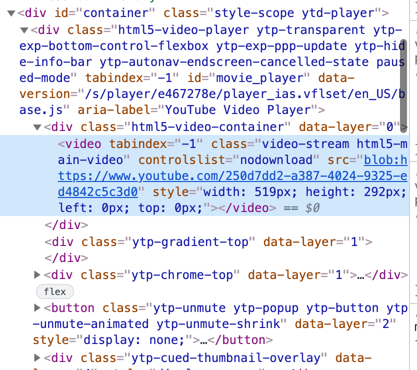
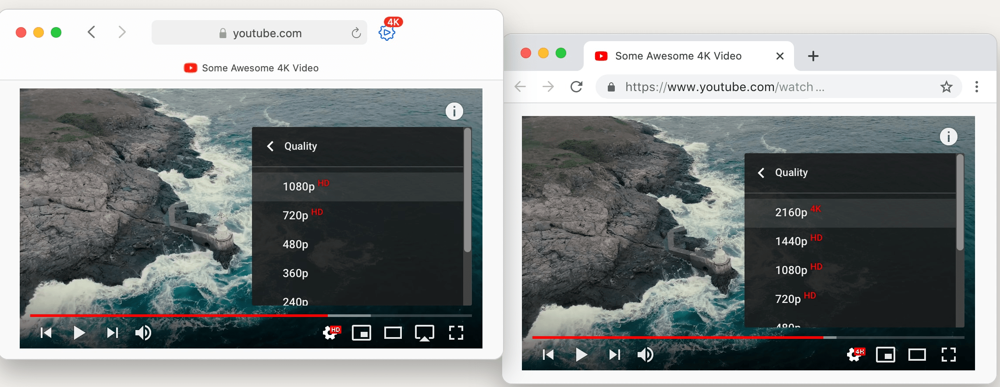
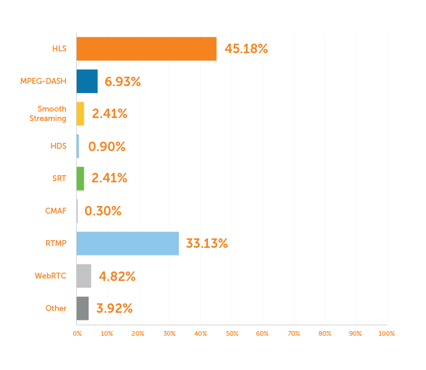
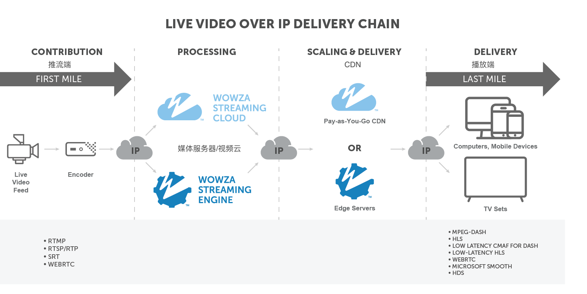
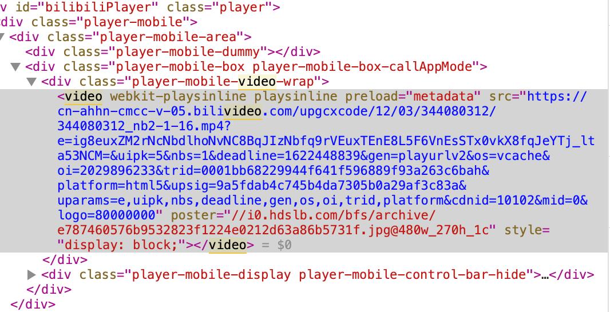
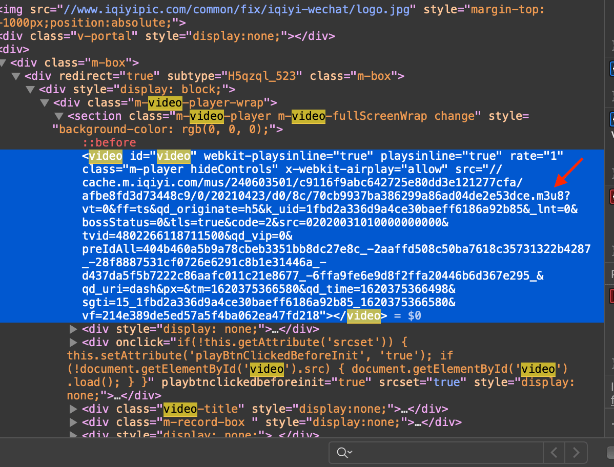
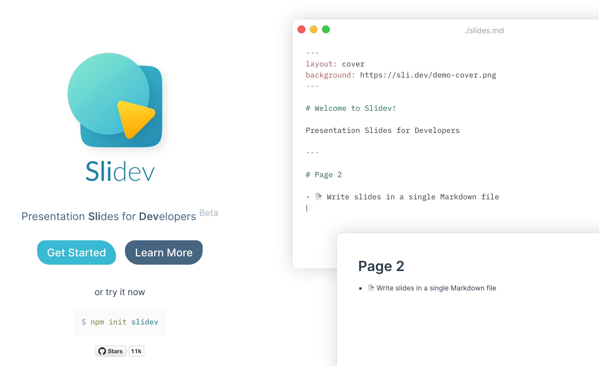

---
# try also 'default' to start simple
theme: seriph
download: false
# random image from a curated Unsplash collection by Anthony
# like them? see https://unsplash.com/collections/94734566/slidev
background: https://source.unsplash.com/collection/94734566/1920x1080
# apply any windi css classes to the current slide
class: 'text-center'
# https://sli.dev/custom/highlighters.html
highlighter: shiki
# some information about the slides, markdown enabled
info: |
  ## Slidev Starter Template
  Presentation slides for developers.

  Learn more at [Sli.dev](https://sli.dev)
---

# <video/>

### 从入门到入坑(maybe 放弃)

<!-- <div class="pt-12">
  <span @click="$slidev.nav.next" class="px-2 p-1 rounded cursor-pointer" hover="bg-white bg-opacity-10">
    Press Space for next page <carbon:arrow-right class="inline"/>
  </span>
</div> -->

<a href="https://github.com/slidevjs/slidev" target="_blank" alt="GitHub"
  class="abs-br m-6 text-xl icon-btn opacity-50 !border-none !hover:text-white">
  <carbon-logo-github />
</a>

<!--
The last comment block of each slide will be treated as slide notes. It will be visible and editable in Presenter Mode along with the slide. [Read more in the docs](https://sli.dev/guide/syntax.html#notes)
-->

---

# 主要内容

<!-- Slidev is a slides maker and presenter designed for developers, consist of the following features -->

- 📝 **video标签用法/用途** - 直接MP4链接

- 🎨 **主流视频网站video标签地址** - Blob URL

- 🧑‍💻 **视频格式、编码**

- 🤹 **流媒体协议** - 主要的流媒体协议有哪些

- 🎥 **点播/直播** - bilibili及主流视频网站用的哪些点播/直播协议

- 📤 **手动下载个B站视频** 

<!-- - 🛠 **Bonus** - Mac native 下载视频app -->

<!-- <br>
<br>

Read more about [Why Slidev?](https://sli.dev/guide/why) -->

<!--
You can have `style` tag in markdown to override the style for the current page.
Learn more: https://sli.dev/guide/syntax#embedded-styles
-->

<style>
h1 {
  background-color: #2B90B6;
  background-image: linear-gradient(45deg, #4EC5D4 10%, #146b8c 20%);
  background-size: 100%;
  -webkit-background-clip: text;
  -moz-background-clip: text;
  -webkit-text-fill-color: transparent; 
  -moz-text-fill-color: transparent;
}
</style>

---
class: 'gradient-h1'
---

# video标签用法/用途

<v-click>
<p>最直接用法</p> 

```html
<video src="./xxx.mp4" autoplay=true playsinline controls="controls"></video>
```
</v-click>

<v-click>
<p>兼容不同格式</p> 

```html
<video autoplay=true playsinline controls="controls">
   <source src="https://www.bilibili.com/xx-demo-720p.webm" type="video/webm">
   <source src="https://www.bilibili.com/xx-demo-720p.mp4" type="video/mp4">   
   浏览器不支持video
</video>
```
</v-click>

<v-click>
<p>更多用途</p>

- 截图 `canvas.getContext("2d").drawImage(video)`
- 精确提取视频帧 `videoEle.requestVideoFrameCallback(() => {})`
- 视频编辑器 (`ffmpeg.wasm`), 浏览器原生 `WebCodecs`

</v-click>

---
class: 'gradient-h1'
---

# 主流视频网站video标签地址

B站/爱优腾，YouTube/Netflix等 基本都是用的 [Blob URL](https://developer.mozilla.org/en-US/docs/Web/API/URL/createObjectURL)

<p>B站地址：</p>

```html
<video src="blob:https://www.bilibili.com/c21f2f47-52fb-46e6-a943-f02e708bceac"></video>
```
<p>YouTube地址：</p>

```html
<video src="blob:https://www.youtube.com/250d7dd2-a387-4024-9325-ed4842c5c3d0"></video>
```

```js
// blob:https://www.youtube.com/250d7dd2-a387-4024-9325-ed4842c5c3d0
const objectURL = URL.createObjectURL(object)
```
`object`可以为： `File`, `Blob`, or [MediaSource](https://developer.mozilla.org/en-US/docs/Web/API/MediaSource)([IOS不支持](https://developer.mozilla.org/en-US/docs/Web/API/MediaSource#browser_compatibility))  
对于流媒体播放来说这里通过`MediaSource`(MediaSource Extension API)来创建Object URL

<!--  -->

<style>
p {
  color: gray
}
a {
  color: #0A8AFA;
}
</style>

---
class: 'gradient-h1'
---

# 视频格式，编码

MDN： https://developer.mozilla.org/en-US/docs/Web/Media/Formats/Video_codecs 


<!-- |     |     |
| --- | --- |
| <kbd>right</kbd> / <kbd>space</kbd>| next animation or slide |
| <kbd>left</kbd> | previous animation or slide |
| <kbd>up</kbd> | previous slide |
| <kbd>down</kbd> | next slide | -->

---
class: 'gradient-h1'
---

# 编码导致Youtube在Safari中不能看4K

油管1080P以上基本用的是VP9, AV1编码; iPhone拍的视频(h.265)在Chrome里放不了



---
class: 'px-20 gradient-h1'
---

# 常用流媒体协议

| 协议       | 应用领域    | 支持音视频编码      | 优缺点  |
| ---       | ---        |  ---     | ---    |
| HTTP-FLV  | 直播        | H.264 + AAC / MP3等      | 延迟低 |
| HLS       | 直播/点播(自适应比特流) | H.265, H.264 + AAC, MP3, Apple Lossless, FLAC...      | Apple搞的协议，兼容性好，延迟高（通过`Low Latency HLS`解决） |
| MPEG-DASH | 直播/点播(自适应比特流) | 不限编码      | 国际标准，对标苹果的HLS |
| RTMP      | 目前主要推流端 | H.264, VP8 等     | 带宽消耗低，延迟低，播放需要Flash |



<style>
  table tr td:first-child {
    white-space: nowrap;
  }
</style>

---
class: 'gradient-h1'
---

# 自适应比特流

点播主流基本就是HLS、MPEG-DASH的自适应比特流


---
class: 'gradient-h1'
---

# 各协议延迟


---
class: 'gradient-h1'
---

# 流媒体播放总体流程

<div grid="~ cols-2 gap-2" m="-t-2">

  

  

</div>

---
class: 'gradient-h1'
---

# 直播链路



---
class: 'gradient-h1'
---

# FLV(FLASH Video) + flv.js

flv.js 的工作原理是将 FLV 文件流转换为 ISO BMFF（Fragmented MP4）片段，然后通过 Media Source Extensions API 将 mp4 段喂给 HTML5 video 元素


---
class: 'gradient-h1'
---

# HLS(HTTP Live Streaming)

HLS 基于 .m3u8 文件查找下面的各个切片文件, [m3u8 demo](https://cdn.jwplayer.com/manifests/l3Hde9mU.m3u8)


---
class: 'gradient-h1'
---

# MPEG-DASH(Dynamic Adaptive Streaming Over HTTP)

MPEG-DASH 基于 .mpd manifest 文件(xml文件)查找下面的各个切片文件, [mpd demo](https://cdn.jwplayer.com/manifests/l3Hde9mU.mpd)


---
class: 'gradient-h1'
---

# 生成符合HLS, MPEG-DASH的工具, 前端播放器

| 协议       | 命令行工具    | 支持的播放器/JS库  |
| ---       | ---        | ---    |
| HTTP-FLV  | FFmpeg        | flv.js |
| HLS       | Apple HTTP Live Streaming tools;<br/> FFmpeg;<br/> Shaka Packager by Google;<br/>mp4box by GPAC;<br/> Bento4  | hls.js, video.js, shaka-player |
| MPEG-DASH | FFmpeg;<br/> Shaka Packager by Google;<br/>mp4box by GPAC;<br/> Bento4 | dash.js, video.js, shaka-player |

---
class: 'gradient-h1'
---

# iOS的情况

<div grid="~ cols-2 gap-2" m="-t-2">

  ```yaml
  ---
  bilibili ios h5
  ---
  ```

  ```yaml
  ---
  爱奇艺 ios h5
  ---
  ```

  

  

</div>

---
class: 'gradient-h1'
---

# 手动下载个B站视频, 播放器看直播

bilibili点播用dash(.m4s --> MPEG-DASH Video Segment); 直播主要flv, hls


---
class: 'gradient-h1'
---

# Bonus - 视频下载工具


<div grid="~ cols-2 gap-2" m="-t-2">

```yaml
---
Mac App: Downie 4, 支持1000+网站
---
```

```yaml
---
开源: youtube-dl - https://github.com/ytdl-org/youtube-dl
---
```


</div>

---
class: 'gradient-h1'
---

# Bonus - [sli.dev](https://sli.dev/) - Presentation Slides for Developers

一个为开发者打造的演示文档工具



---
layout: center
class: text-center
---

# <Party v-if="$slidev.nav.currentPage === 20">🎉 Happy Children's Day 🥳</Party>

